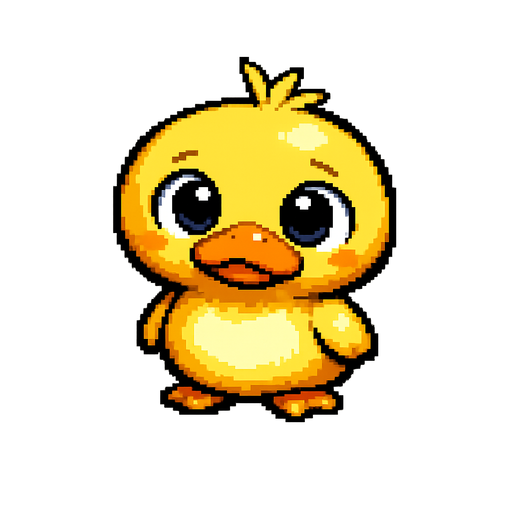
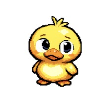
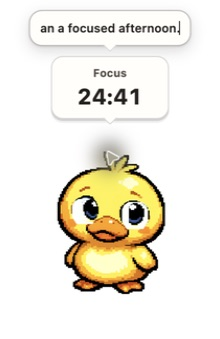
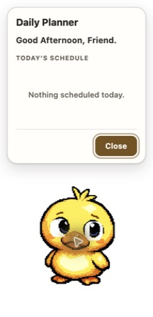
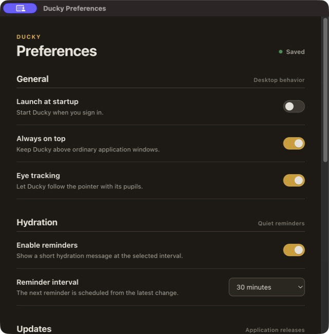
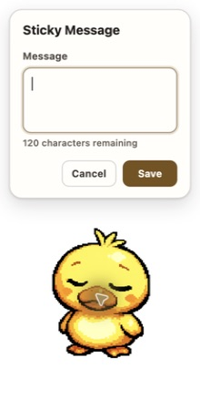
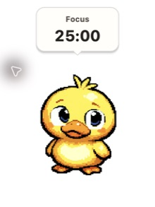
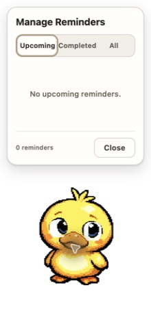
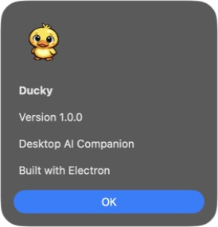

<div align="center">



# Ducky

### A small desktop AI companion for focused work.


</div>



Ducky lives quietly on your desktop, helps you stay focused, and gives AI a simple, personal place to live. It is lightweight, local-first, and designed to stay out of the way.

## Features

| | | |
|---|---|---|
| **AI companion**<br>Ask questions inline without opening a chat window. | **Smart reminders**<br>One-time and recurring reminders with a focused widget. | **Daily planner**<br>See today's schedule at a glance. |
| **Sticky notes**<br>Keep one lightweight message visible. | **Pomodoro**<br>Run a persistent focus session beside Ducky. | **Model Explorer**<br>Search, favorite, and switch between discovered models. |
| **Native desktop**<br>Tray, Preferences, Spaces, dragging, and always-on-top support. | **Cross-platform**<br>macOS, Windows, and Linux packaging. | **Update-ready**<br>Electron's secure update foundation is included. |

## Screenshot gallery

| Desktop | AI conversation |
|---|---|
|  |  |
| **Planner** | **Preferences** |
|  |  |
| **Sticky message** | **Pomodoro** |
|  |  |
| **Reminders** | **About** |
|  |  |

## AI providers

- **OpenAI, Gemini, and Grok** — cloud providers using your own API credentials.
- **Ollama** — local models through the Ollama daemon; no cloud key required.
- **OpenRouter and compatible endpoints** — connect to OpenAI-compatible model catalogs.

Credentials stay in the Electron main process and use secure storage when available.

## Install

Download the latest release for your platform from [GitHub Releases](https://github.com/amanbotx2-fr/PsyDuck-Companion/releases).

- macOS: open the DMG and drag Ducky to Applications.
- Windows: run the Setup or MSI installer.
- Linux: launch the AppImage or install the DEB package.

## Build from source

Requires Node.js 22.12+ and npm 10+.

```bash
npm install
npm run dev
```

Build a production package with `npm run dist`.

## Repository layout

`src/main` · Electron lifecycle, IPC, persistence, and services<br>
`src/renderer` · Companion and Preferences React apps<br>
`src/ai` · Provider abstractions and integrations<br>
`src/engine` · Animation, behavior, input, and scheduling primitives<br>
`src/shared` · Typed contracts shared across processes<br>
`character` · Source artwork and animation frames

## License

[MIT](LICENSE) © Aman
